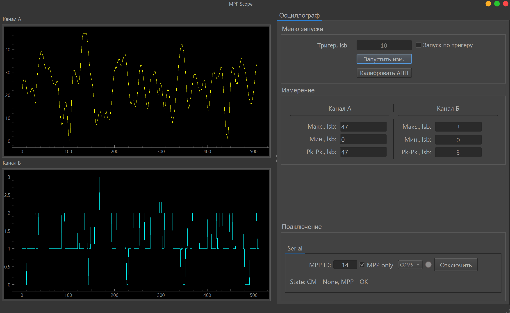

# MPP Scope

## Скриншот


Приложение на PyQt6 для визуализации и измерения сигналов МПП: асинхронные операции (qasync), отрисовка графиков (pyqtgraph), подключения по Serial/Modbus. Точка входа — `main.py`.


## Содержание
- О проекте
- Быстрый старт (uv)
- Примеры кода
- Сборка (PyInstaller)
- Структура проекта
- Полезные команды
- Примечания

## О проекте
- UI: PyQt6 + qtmodern (ModernWindow).
- Графики: pyqtgraph.
- Асинхронность: `qasync` (asyncio + Qt event loop).
- Подключения: последовательный порт (`pyserial`), Modbus (`pymodbus`).
- Обработка данных: `src/filters_data.py` — max/min/pk-pk/median/moving average/exp smoothing и др.

## Быстрый старт (uv)
Требуется Python `>= 3.11` и установленный `uv`.

```bash
# 1) создать виртуальное окружение
uv venv

# 2) активировать окружение
#   Windows
.\\.venv\\Scripts\\activate
#   Linux/macOS
source .venv/bin/activate

# 3) установить зависимости
uv sync

# 4) запустить приложение
uv run python main.py
# или при активированном venv
python main.py
```

## Сборка (PyInstaller)

### Вариант A — без установки в проект (через uvx)
```bash
uvx pyinstaller --noconfirm --windowed --name mpp-scope \
  --collect-all PyQt6 --collect-submodules PyQt6 --hidden-import PyQt6.sip \
  main.py
```

### Вариант B — установить в окружение и собрать
```bash
uv add --dev pyinstaller
uv run pyinstaller --noconfirm --windowed --name mpp-scope \
  --collect-all PyQt6 --collect-submodules PyQt6 --hidden-import PyQt6.sip \
  main.py
```

Опции:
- `--onefile` — собрать один EXE-файл (Windows): добавьте к команде.
- `--icon path/to/icon.ico` — добавить иконку.
Результат: `dist/mpp-scope/` (папка) или единый `mpp-scope.exe` при `--onefile`.

## Структура проекта
```text
.
├─ main.py                         # Точка входа (Qt app + qasync)
├─ pyproject.toml                  # Зависимости (PyQt6, pyqtgraph, qasync, pymodbus, pyserial и др.)
├─ modules/
│  ├─ Engine/
│  │  ├─ engine.py                 # Главный виджет/движок приложения
│  │  ├─ engine.ui                 # UI-файл движка
│  │  └─ widgets/oscilloscope/
│  │     ├─ graph_widget.py/.ui    # Графики
│  │     ├─ measure_widget.py/.ui  # Измерения
│  │     ├─ run_meas_widget.py/.ui # Запуск/панель измерений
│  │     └─ flux_widget.py/.ui     # Доп. виджет
│  └─ Main_Serial/
│     ├─ main_serial_dialog.py     # Диалог Serial
│     ├─ main_serial_dialog_tcp.py # Диалог TCP
│     ├─ DialogSerial.ui           # UI Serial
│     └─ DialogSerialTCP.ui        # UI TCP
├─ src/
│  ├─ filters_data.py              # Набор фильтров измерений
│  ├─ plot_renderer.py             # Рендеринг графиков
│  ├─ customComboBox_COMport.py    # Комбобокс портов
│  ├─ modbus_worker.py             # Работа с Modbus
│  ├─ main_window_maker.py         # Конструирование главного окна
│  ├─ ddii_command.py, parsers*.py # Служебная логика
│  └─ external/QCustomWindow/      # Внешний модуль оформления окна
├─ custom/
│  └─ widgets.py                   # Кастомные виджеты
├─ README.md
└─ LICENSE
```

## Полезные команды (uv)
- Добавить зависимость: `uv add <package>` (или `uv add --dev <package>`)  
- Запуск приложения: `uv run python main.py`
- Список пакетов: `uv pip list`

## Примечания
- На Windows при сборке PyInstaller Qt-плагины подтягиваются через `--collect-all PyQt6`; при необходимости добавьте `--collect-all qtpy` и др.
- Если нет доступа к сети — выполните `uv sync` заранее в онлайне, затем собирайте офлайн в том же окружении.
